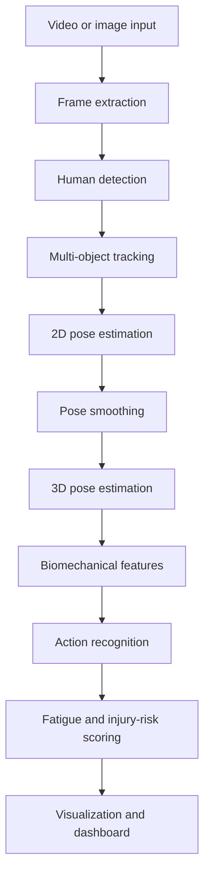

# Human Posture Analysis for Sports Video

This project is a modular computer vision pipeline for sports posture analysis. It currently supports video frame extraction, 2D human pose estimation with RTMLib, and live pose visualization. The architecture is prepared for later stages such as tracking, smoothing, biomechanics, action recognition, and fatigue or injury-risk scoring.

## Architecture



Reusable code lives in `src/hpa/`. Command-line scripts live in `src/scripts/`.

## Setup

Create and activate a virtual environment:

```bash
python -m venv .venv
.venv\Scripts\activate
```

Install dependencies and the local package:

```bash
pip install -r requirements.txt
pip install -e .
```

After editable install, imports work like:

```python
from hpa.io.video_io import extract_frames
```

## Model Management

Models are stored locally under `models/`. Real model files are not committed to GitHub because they are large. The tracked `.gitkeep` files only preserve the folder structure.

Download the configured RTMLib detector and pose models:

```bash
python src/scripts/download_models.py
```

The model sources and local target paths are defined in `configs/models.yaml`. If local model files are missing, the pose estimator prints a clear warning and falls back to RTMLib defaults, which may download models on first use.

## Data Folders

The new standard paths are:

```text
data/raw/videos/                  # input videos
data/raw/images/                  # input images
data/interim/frames/              # extracted frames
data/processed/detections/        # future human detections
data/processed/keypoints/         # 2D pose keypoints
data/processed/tracks/            # future tracking results
data/processed/smoothed_keypoints/# future smoothed poses
data/processed/biomechanics/      # future biomechanical features
data/outputs/annotated_frames/    # rendered pose frames
data/outputs/videos/              # rendered videos
data/outputs/reports/             # generated reports
```

Older folders such as `data/videos/` and `data/frames/` may still exist from earlier stages. Keep using them for old experiments if needed, but new work should use `data/raw/videos/` and `data/interim/frames/`.

## Stage 1: Extract Frames

Place a video at `data/raw/videos/test.mp4`, then run:

```bash
python src/scripts/extract_frames.py --video data/raw/videos/test.mp4
```

By default, this saves one frame every 30 frames into `data/interim/frames`.

## Stage 2: Pose Estimation on Frames

Run 2D pose estimation and save both CSV keypoints and annotated images:

```bash
python src/scripts/run_pose_on_frames.py
```

By default, this reads frames from `data/interim/frames`, saves keypoints to `data/processed/keypoints/keypoints.csv`, and saves annotated frames to `data/outputs/annotated_frames`.

The CSV schema is:

```text
frame_name, person_id, keypoint_id, x, y, confidence
```

## Live Pose Demo

Run live visualization on a video:

```bash
python src/scripts/live_pose_demo.py --video data/raw/videos/test.mp4
```

By default, the live demo saves:

```text
data/processed/keypoints/live_keypoints.csv
data/outputs/videos/live_pose_demo.mp4
```

The live CSV includes timing columns:

```text
frame_name, frame_index, time_sec, person_id, keypoint_id, x, y, confidence
```

Press `q` in the OpenCV window to quit.

For better speed, you can use optional arguments:

```bash
python src/scripts/live_pose_demo.py --video data/raw/videos/test.mp4 --device cuda --mode lightweight --max-width 640
```

To choose custom live outputs:

```bash
python src/scripts/live_pose_demo.py --video data/raw/videos/test.mp4 --output-csv data/processed/keypoints/my_live_keypoints.csv --output-video data/outputs/videos/my_live_demo.mp4
```

To display only and skip saving:

```bash
python src/scripts/live_pose_demo.py --video data/raw/videos/test.mp4 --no-save
```

## Stage 3: Pose Smoothing and Quality Check

Smooth raw 2D keypoints before biomechanics:

```bash
python src/scripts/smooth_keypoints.py --input data/processed/keypoints/keypoints.csv --output data/processed/smoothed_keypoints/smoothed_keypoints.csv --quality-report data/outputs/reports/pose_quality.csv --window-size 5
```

By default, this reads `data/processed/keypoints/keypoints.csv`, smooths `x` and `y` per `person_id` and `keypoint_id`, keeps confidence unchanged, and writes a quality report to `data/outputs/reports/pose_quality.csv`.

## Stage 4: OpenCap-Style Biomechanical Features

Extract OpenCap-inspired 2D biomechanical surrogate features from smoothed keypoints:

```bash
python src/scripts/extract_opencap_style_features.py --input data/processed/smoothed_keypoints/smoothed_keypoints.csv --output data/processed/biomechanics/opencap_style_features.csv --plots-dir data/outputs/reports/opencap_style_plots --confidence-threshold 0.3
```

This creates:

```text
data/processed/biomechanics/opencap_style_features.csv
data/outputs/reports/opencap_style_plots/knee_angles.png
data/outputs/reports/opencap_style_plots/hip_angles.png
data/outputs/reports/opencap_style_plots/trunk_lean.png
data/outputs/reports/opencap_style_plots/asymmetry.png
```

These are OpenCap-style or OpenCap-inspired 2D surrogate features. This project is not using the full OpenCap cloud/system pipeline yet, and these features are not calibrated 3D biomechanics.

Future work: full OpenCap or Pose2Sim integration requires calibrated multi-camera data or the OpenCap capture workflow.

## Compatibility Commands

The earlier script paths are still present as wrappers:

```bash
python src/extract_frames.py --video data/raw/videos/test.mp4 --output data/interim/frames --step 30
python src/pose_estimation.py --input data/interim/frames --output-csv data/processed/keypoints/keypoints.csv --output-frames data/outputs/annotated_frames
python src/live_pose_demo.py --video data/raw/videos/test.mp4
```

## Roadmap

- `hpa.io`: video input, image input, frame extraction
- `hpa.detection`: human detection
- `hpa.tracking`: multi-object tracking
- `hpa.pose`: 2D pose estimation and visualization
- `hpa.smoothing`: temporal keypoint smoothing
- `hpa.biomechanics`: joint angles and movement features
- `hpa.actions`: sport action recognition
- `hpa.risk`: fatigue and injury-risk scoring
- dashboard layer: visual analytics and reports
