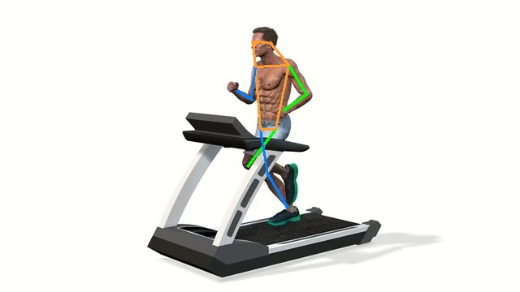
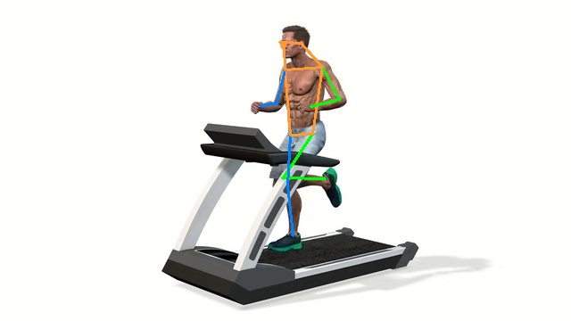
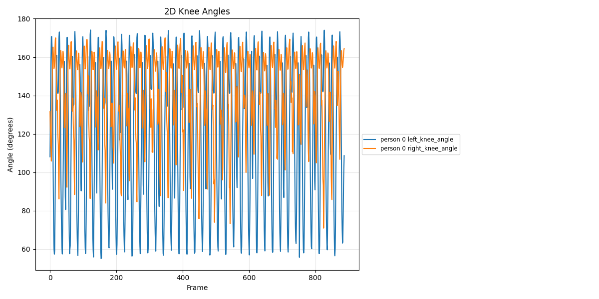
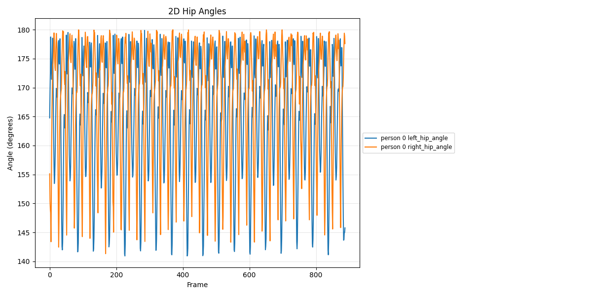
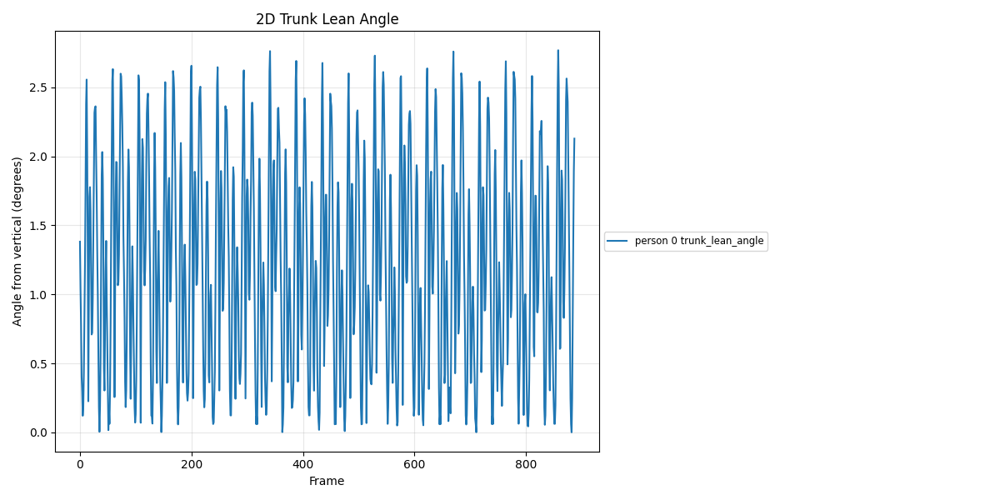
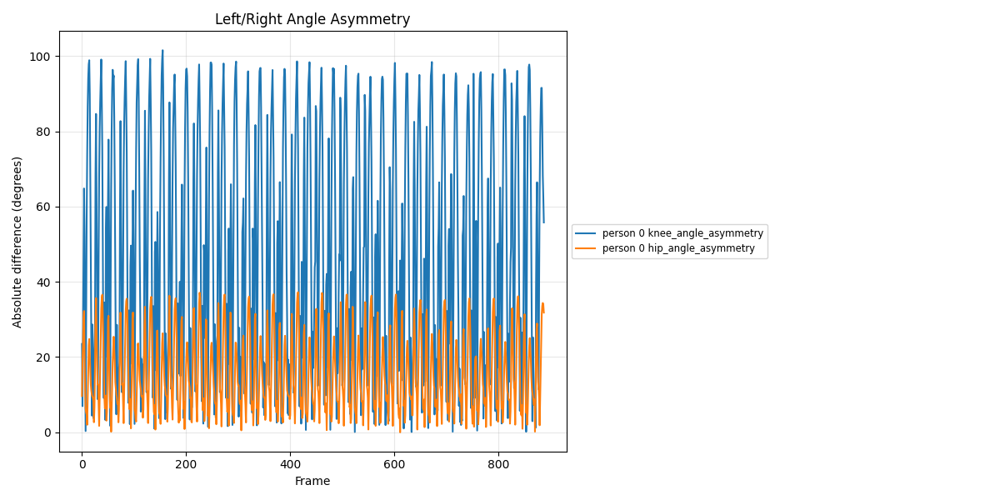

# Computer Vision Pipeline for Human Posture and Sports Movement Analysis  
## Repository-Based Academic Report and Implementation Review

**Project repository:** `mehditalebi01/HCI-for-Human-Posture-Analysis`  
**Report purpose:** academic description of the implemented pipeline, tool/model choices, experimental results, limitations, and next development steps.  
**Status:** research prototype; not a validated clinical, diagnostic, or full 3D biomechanical analysis system.

---

## Abstract

This project implements a modular computer vision pipeline for sports posture and human movement analysis from video input, using frame extraction, 2D human pose estimation, temporal smoothing, quality screening, and OpenCap-inspired 2D biomechanical feature extraction [[1]](https://github.com/mehditalebi01/HCI-for-Human-Posture-Analysis), [[3]](https://docs.opencv.org/4.x/dd/d43/tutorial_py_video_display.html), [[4]](https://arxiv.org/abs/2303.07399), [[12]](https://pubmed.ncbi.nlm.nih.gov/37856442/). The current implementation should be interpreted as a practical research prototype because it estimates image-plane 2D features from monocular video rather than calibrated 3D joint kinematics or full musculoskeletal dynamics [[10]](https://github.com/perfanalytics/pose2sim), [[12]](https://pubmed.ncbi.nlm.nih.gov/37856442/), [[13]](https://www.mdpi.com/1424-8220/22/5/1729). The main engineering goal is to create a clear, reproducible, layer-by-layer pipeline that can later be upgraded toward Pose2Sim-style 3D reconstruction or OpenCap-style biomechanical analysis [[10]](https://github.com/perfanalytics/pose2sim), [[11]](https://www.mdpi.com/1424-8220/21/21/6535), [[12]](https://pubmed.ncbi.nlm.nih.gov/37856442/).

The implemented pipeline uses OpenCV for video I/O, RTMLib/RTMPose for 2D body keypoint estimation, ONNX Runtime for deployable inference, pandas for tabular processing and smoothing, and custom Python modules under `src/hpa/` for reusable scientific logic [[3]](https://docs.opencv.org/4.x/dd/d43/tutorial_py_video_display.html), [[4]](https://arxiv.org/abs/2303.07399), [[5]](https://github.com/Tau-J/rtmlib), [[8]](https://onnxruntime.ai/docs/execution-providers/CUDA-ExecutionProvider.html), [[9]](https://pandas.pydata.org/docs/reference/api/pandas.DataFrame.rolling.html). This architecture is appropriate for an academic student project because each layer can be executed, inspected, reported, and validated independently before downstream biomechanical interpretation is attempted [[15]](https://packaging.python.org/en/latest/discussions/src-layout-vs-flat-layout/).

---

## 1. Project Scope and Research Objective

The objective of the project is to estimate human body posture and simple sports-movement indicators from ordinary videos, with a focus on making the pipeline practical enough to run locally while remaining scientifically honest about what can and cannot be concluded from 2D keypoints [[1]](https://github.com/mehditalebi01/HCI-for-Human-Posture-Analysis), [[4]](https://arxiv.org/abs/2303.07399), [[13]](https://www.mdpi.com/1424-8220/22/5/1729). The project does not currently claim to replace laboratory marker-based motion capture, OpenCap, or Pose2Sim because those systems rely on stronger calibration, multi-view geometry, musculoskeletal modeling, or more complete 3D processing workflows [[10]](https://github.com/perfanalytics/pose2sim), [[11]](https://www.mdpi.com/1424-8220/21/21/6535), [[12]](https://pubmed.ncbi.nlm.nih.gov/37856442/).

The current scientific contribution is an end-to-end educational and experimental pipeline that converts raw video into interpretable posture features such as knee angle, hip angle, trunk lean, left-right angular difference, and pose confidence statistics [[1]](https://github.com/mehditalebi01/HCI-for-Human-Posture-Analysis), [[9]](https://pandas.pydata.org/docs/reference/api/pandas.DataFrame.rolling.html), [[12]](https://pubmed.ncbi.nlm.nih.gov/37856442/). This makes the project suitable for presentation, classroom demonstration, internship documentation, and as a base for later validation experiments with external datasets or controlled video recordings [[10]](https://github.com/perfanalytics/pose2sim), [[13]](https://www.mdpi.com/1424-8220/22/5/1729).

---

## 2. Repository and Architecture Review

The repository has moved in the right direction by separating reusable pipeline modules from executable scripts, which is better than keeping extraction, inference, visualization, smoothing, and reporting logic in one monolithic file [[1]](https://github.com/mehditalebi01/HCI-for-Human-Posture-Analysis), [[15]](https://packaging.python.org/en/latest/discussions/src-layout-vs-flat-layout/). The `src/hpa/` package acts as the scientific core of the project, while `src/scripts/` acts as the command-line interface layer that calls those reusable modules [[1]](https://github.com/mehditalebi01/HCI-for-Human-Posture-Analysis), [[15]](https://packaging.python.org/en/latest/discussions/src-layout-vs-flat-layout/). This structure is important because the same core code can later be reused by batch scripts, live demos, notebooks, tests, or a future graphical interface [[15]](https://packaging.python.org/en/latest/discussions/src-layout-vs-flat-layout/).

The current repository can be understood as a layered architecture: `hpa.io` handles video and image I/O, `hpa.pose` handles pose model inference, `hpa.smoothing` handles temporal cleanup and quality metrics, `hpa.biomechanics` handles angle-based feature extraction, and scripts orchestrate these layers into a full workflow [[1]](https://github.com/mehditalebi01/HCI-for-Human-Posture-Analysis). This modular design is appropriate because video decoding errors, pose-estimation errors, temporal jitter, and biomechanical interpretation errors are different classes of problems and should be debugged separately [[3]](https://docs.opencv.org/4.x/dd/d43/tutorial_py_video_display.html), [[4]](https://arxiv.org/abs/2303.07399), [[9]](https://pandas.pydata.org/docs/reference/api/pandas.DataFrame.rolling.html), [[13]](https://www.mdpi.com/1424-8220/22/5/1729).

```text
Raw video
  -> Video I/O layer: frame extraction with OpenCV
  -> Pose layer: person detection + 2D keypoint estimation with RTMLib/RTMPose
  -> Visualization layer: annotated frames or live OpenCV window
  -> Smoothing layer: per-keypoint temporal moving average
  -> Biomechanics layer: 2D angle and posture-feature extraction
  -> Reporting layer: tables, plots, academic interpretation, limitations
```

The architecture is already compatible with future upgrades because RTMPose outputs 2D keypoints that can be reused by higher-level systems, and Pose2Sim explicitly accepts 2D pose detections as part of a full workflow toward 3D triangulation and OpenSim kinematics [[4]](https://arxiv.org/abs/2303.07399), [[10]](https://github.com/perfanalytics/pose2sim), [[11]](https://www.mdpi.com/1424-8220/21/21/6535). The current project therefore represents a reasonable first milestone: a working 2D pipeline that can later be extended into a calibrated multi-camera 3D pipeline [[10]](https://github.com/perfanalytics/pose2sim), [[11]](https://www.mdpi.com/1424-8220/21/21/6535).

---

## 3. Stage 0 — Environment, Dependencies, and Model Management

The project dependencies include `opencv-python`, `numpy`, `pandas`, `matplotlib`, `tqdm`, `rtmlib`, `pyyaml`, and `onnxruntime`, which form a lightweight Python stack for video processing, numerical computation, tabular analysis, plotting, progress reporting, model inference, configuration, and ONNX deployment [[3]](https://docs.opencv.org/4.x/dd/d43/tutorial_py_video_display.html), [[5]](https://github.com/Tau-J/rtmlib), [[8]](https://onnxruntime.ai/docs/execution-providers/CUDA-ExecutionProvider.html), [[9]](https://pandas.pydata.org/docs/reference/api/pandas.DataFrame.rolling.html). This dependency set is suitable for a student research prototype because it avoids a heavy full MMPose installation while still using modern pose-estimation models through RTMLib [[4]](https://arxiv.org/abs/2303.07399), [[5]](https://github.com/Tau-J/rtmlib), [[7]](https://mmpose.readthedocs.io/).

The project should keep model files under a dedicated `models/` directory and load them through configuration, rather than allowing hidden automatic downloads to be the only reproducibility mechanism [[1]](https://github.com/mehditalebi01/HCI-for-Human-Posture-Analysis), [[5]](https://github.com/Tau-J/rtmlib), [[8]](https://onnxruntime.ai/docs/execution-providers/CUDA-ExecutionProvider.html). Local checkpoint management is better for academic reporting because the exact detector model, pose model, runtime backend, and device can be documented and reused in future experiments [[4]](https://arxiv.org/abs/2303.07399), [[6]](https://arxiv.org/abs/2107.08430), [[8]](https://onnxruntime.ai/docs/execution-providers/CUDA-ExecutionProvider.html). The current code already moves toward this goal by checking whether local model paths exist and warning when RTMLib may need to download default models [[1]](https://github.com/mehditalebi01/HCI-for-Human-Posture-Analysis), [[5]](https://github.com/Tau-J/rtmlib).

Recommended model-management convention:

```text
models/
  detection/
    yolox_m_8xb8-300e_humanart.onnx
  pose/
    rtmpose-m_simcc-body7_420e-256x192.onnx
configs/
  models.yaml
  pipeline.yaml
```

This convention makes the pipeline reproducible because the report can state exactly which detector, pose-estimator, backend, input resolution, and device were used in an experiment [[4]](https://arxiv.org/abs/2303.07399), [[6]](https://arxiv.org/abs/2107.08430), [[8]](https://onnxruntime.ai/docs/execution-providers/CUDA-ExecutionProvider.html). It also makes the project easier to scale because future experiments can compare `lightweight`, `balanced`, and `performance` settings without changing the scientific code [[4]](https://arxiv.org/abs/2303.07399), [[5]](https://github.com/Tau-J/rtmlib).

---

## 4. Stage 1 — Video Input and Frame Extraction

The first operational stage reads a video file and extracts frames using OpenCV, which is a standard computer-vision library for camera and video-file input in Python [[3]](https://docs.opencv.org/4.x/dd/d43/tutorial_py_video_display.html). In the current project, frame extraction is useful because it creates inspectable image files before running the pose estimator, allowing the developer to verify that the subject, camera angle, lighting, and sampling rate are appropriate [[1]](https://github.com/mehditalebi01/HCI-for-Human-Posture-Analysis), [[3]](https://docs.opencv.org/4.x/dd/d43/tutorial_py_video_display.html).

The early test run reported 413 total frames, 25 FPS, 16.52 seconds of video duration, and 14 saved frames when sampling every 30 frames. This result confirms that the video decoder and frame-saving stage are working, but it also shows that `step=30` produces a sparse temporal sample that is useful for debugging but too coarse for detailed gait-cycle or sports-movement analysis [[3]](https://docs.opencv.org/4.x/dd/d43/tutorial_py_video_display.html), [[13]](https://www.mdpi.com/1424-8220/22/5/1729). For future analysis of running, jumping, squatting, or fast sport actions, a smaller frame step or full-frame processing should be used because joint angles can change rapidly between sparse sampled frames [[13]](https://www.mdpi.com/1424-8220/22/5/1729).

The recommended use of frame extraction is therefore two-level: use sparse extraction for fast debugging, and use dense extraction or direct video inference for final experiments [[3]](https://docs.opencv.org/4.x/dd/d43/tutorial_py_video_display.html), [[4]](https://arxiv.org/abs/2303.07399). Sparse extraction reduces computation and makes early inspection easier, while dense processing preserves the motion signal required for temporal smoothing and gait-phase interpretation [[9]](https://pandas.pydata.org/docs/reference/api/pandas.DataFrame.rolling.html), [[13]](https://www.mdpi.com/1424-8220/22/5/1729).

---

## 5. Stage 2 — 2D Human Pose Estimation

The second stage estimates 2D body keypoints using RTMLib’s `Body` wrapper, which provides a simpler interface to RTMPose-based human pose estimation than setting up the complete MMPose framework manually [[4]](https://arxiv.org/abs/2303.07399), [[5]](https://github.com/Tau-J/rtmlib), [[7]](https://mmpose.readthedocs.io/). RTMPose is an appropriate choice because it was designed as a real-time multi-person pose estimation framework with strong speed-accuracy characteristics, which directly matches the project’s need for both offline processing and live visualization [[4]](https://arxiv.org/abs/2303.07399).

The current pose-estimation layer wraps RTMLib inside a project-specific `RTMPoseEstimator` class, which is good software engineering because model initialization, local checkpoint paths, backend selection, CUDA warnings, and folder inference are kept in one reusable location [[1]](https://github.com/mehditalebi01/HCI-for-Human-Posture-Analysis), [[5]](https://github.com/Tau-J/rtmlib), [[8]](https://onnxruntime.ai/docs/execution-providers/CUDA-ExecutionProvider.html). The wrapper also makes future upgrades easier because the outer pipeline can keep the same interface even if the internal model changes from RTMPose-M to RTMPose-L, ViTPose, or another MMPose-compatible estimator [[4]](https://arxiv.org/abs/2303.07399), [[7]](https://mmpose.readthedocs.io/), [[18]](https://arxiv.org/abs/2204.12484).

RTMLib’s default human-detection stage commonly relies on YOLOX-style detectors, and YOLOX is a strong practical choice because it uses an anchor-free design, decoupled head, and modern label-assignment strategy to improve object-detection performance [[5]](https://github.com/Tau-J/rtmlib), [[6]](https://arxiv.org/abs/2107.08430). In this pipeline, the detector is not the final research output, but it is critical because poor person bounding boxes will degrade every downstream keypoint, smoothing, and biomechanical feature [[6]](https://arxiv.org/abs/2107.08430), [[13]](https://www.mdpi.com/1424-8220/22/5/1729).

The early pose-estimation run processed 14 extracted frames and successfully saved both a keypoint CSV and annotated output frames. This confirms that the RTMLib model download, ONNX model loading, inference loop, CSV export, and visualization output are functioning as a complete batch-pose stage [[4]](https://arxiv.org/abs/2303.07399), [[5]](https://github.com/Tau-J/rtmlib), [[8]](https://onnxruntime.ai/docs/execution-providers/CUDA-ExecutionProvider.html). For final experiments, the project should record the exact model mode, checkpoint filenames, runtime backend, device, input resolution, video name, number of frames, and confidence threshold because these parameters affect reproducibility and comparability [[4]](https://arxiv.org/abs/2303.07399), [[6]](https://arxiv.org/abs/2107.08430), [[8]](https://onnxruntime.ai/docs/execution-providers/CUDA-ExecutionProvider.html).

---

## 6. Stage 3 — Live Visualization with OpenCV

The live visualization stage is important because numerical confidence scores alone are not sufficient to prove that the skeleton is attached to the correct body landmarks [[3]](https://docs.opencv.org/4.x/dd/d43/tutorial_py_video_display.html), [[4]](https://arxiv.org/abs/2303.07399). OpenCV is the correct tool for this stage because it can read frames, resize them for speed, draw skeleton overlays, and display the annotated stream in a real-time window [[3]](https://docs.opencv.org/4.x/dd/d43/tutorial_py_video_display.html).

For live use, the project should prioritize `mode="lightweight"` or a smaller input width first, because real-time demos are sensitive to latency and frame drops [[4]](https://arxiv.org/abs/2303.07399), [[5]](https://github.com/Tau-J/rtmlib), [[8]](https://onnxruntime.ai/docs/execution-providers/CUDA-ExecutionProvider.html). For final offline reports, the project should switch to `balanced` or a higher-resolution model if the additional computation improves visual keypoint stability and downstream angle reliability [[4]](https://arxiv.org/abs/2303.07399), [[13]](https://www.mdpi.com/1424-8220/22/5/1729).

The live demo should report FPS, device, backend, and number of detected people on-screen because these values make the demo scientifically interpretable instead of only visually impressive [[3]](https://docs.opencv.org/4.x/dd/d43/tutorial_py_video_display.html), [[8]](https://onnxruntime.ai/docs/execution-providers/CUDA-ExecutionProvider.html). The project should also allow optional recording of live outputs to video and CSV, because academic reports need persistent evidence rather than only a temporary display window [[1]](https://github.com/mehditalebi01/HCI-for-Human-Posture-Analysis), [[3]](https://docs.opencv.org/4.x/dd/d43/tutorial_py_video_display.html).

---

## 7. Stage 4 — Temporal Smoothing and Pose Quality Checking

The smoothing stage applies a centered moving average to the `x` and `y` coordinates of each keypoint separately for each person and keypoint ID [[9]](https://pandas.pydata.org/docs/reference/api/pandas.DataFrame.rolling.html). This is an appropriate baseline because pose estimators often produce frame-to-frame jitter, and a simple rolling mean is easy to explain, reproduce, and debug in an academic report [[9]](https://pandas.pydata.org/docs/reference/api/pandas.DataFrame.rolling.html), [[13]](https://www.mdpi.com/1424-8220/22/5/1729).

The implementation correctly avoids smoothing confidence values because confidence is a diagnostic signal from the pose estimator and should remain available for quality filtering [[4]](https://arxiv.org/abs/2303.07399), [[9]](https://pandas.pydata.org/docs/reference/api/pandas.DataFrame.rolling.html). If low-confidence values were smoothed or hidden, the later biomechanics layer could treat unreliable keypoints as if they were reliable measurements [[4]](https://arxiv.org/abs/2303.07399), [[13]](https://www.mdpi.com/1424-8220/22/5/1729).

The current quality metrics include total keypoints, average confidence, low-confidence count, low-confidence ratio, and processed frame count [[1]](https://github.com/mehditalebi01/HCI-for-Human-Posture-Analysis), [[9]](https://pandas.pydata.org/docs/reference/api/pandas.DataFrame.rolling.html). These metrics are a good minimum quality-control layer, but future versions should add per-joint confidence summaries, missing-joint counts, temporal continuity checks, and frame-level failure flags because single aggregate confidence can hide systematic errors in small or occluded joints [[4]](https://arxiv.org/abs/2303.07399), [[13]](https://www.mdpi.com/1424-8220/22/5/1729).

---

## 8. Stage 5 — OpenCap-Inspired 2D Biomechanical Feature Extraction

The biomechanics layer computes interpretable 2D features from the detected keypoints, including left and right knee angles, left and right hip angles, trunk lean angle, left-right knee-angle difference, left-right hip-angle difference, mean pose confidence, and low-confidence flags [[1]](https://github.com/mehditalebi01/HCI-for-Human-Posture-Analysis), [[12]](https://pubmed.ncbi.nlm.nih.gov/37856442/), [[13]](https://www.mdpi.com/1424-8220/22/5/1729). The code explicitly maps common COCO-17 body landmarks such as shoulders, hips, knees, and ankles, which is appropriate because COCO-style keypoint order is widely used in modern 2D pose-estimation pipelines [[4]](https://arxiv.org/abs/2303.07399), [[16]](https://arxiv.org/abs/1405.0312).

The OpenCap-inspired label is scientifically useful but must be used carefully because OpenCap estimates human movement dynamics from smartphone videos using a dedicated workflow, while the present project computes 2D image-plane surrogate measures from monocular keypoints [[12]](https://pubmed.ncbi.nlm.nih.gov/37856442/), [[13]](https://www.mdpi.com/1424-8220/22/5/1729). Therefore, the extracted values are appropriate for posture screening, visualization, and educational analysis, but they should not yet be reported as validated 3D kinematics or clinical biomechanics [[12]](https://pubmed.ncbi.nlm.nih.gov/37856442/), [[13]](https://www.mdpi.com/1424-8220/22/5/1729).

The current feature design is still valuable because simple 2D angular features are understandable to non-specialist audiences and can be plotted over time to show movement phases [[9]](https://pandas.pydata.org/docs/reference/api/pandas.DataFrame.rolling.html), [[13]](https://www.mdpi.com/1424-8220/22/5/1729). The next scientific upgrade should be gait-cycle segmentation or repetition segmentation, because instantaneous left-right angular difference is not the same as clinical asymmetry unless left and right limbs are compared at matched movement phases [[10]](https://github.com/perfanalytics/pose2sim), [[13]](https://www.mdpi.com/1424-8220/22/5/1729).

---

## 9. Current Experimental Results

The early frame-extraction test processed a 16.52-second video with 413 frames at 25 FPS and saved 14 sampled frames using a step of 30. This output demonstrates that the video decoding and extraction stage works, but it should be considered a debugging run rather than a final temporal-motion experiment because only 14 frames were retained from the full movement sequence [[3]](https://docs.opencv.org/4.x/dd/d43/tutorial_py_video_display.html), [[13]](https://www.mdpi.com/1424-8220/22/5/1729).

The early pose-estimation test then processed all 14 extracted frames, loaded YOLOX and RTMPose ONNX models through RTMLib/ONNX Runtime, saved `data/output/keypoints.csv`, and produced annotated frames under `data/output/pose_frames` [[4]](https://arxiv.org/abs/2303.07399), [[5]](https://github.com/Tau-J/rtmlib), [[6]](https://arxiv.org/abs/2107.08430), [[8]](https://onnxruntime.ai/docs/execution-providers/CUDA-ExecutionProvider.html). This is a successful minimum viable result because the project has already completed the chain from raw video to extracted images, detected keypoints, and visual pose overlays [[1]](https://github.com/mehditalebi01/HCI-for-Human-Posture-Analysis), [[3]](https://docs.opencv.org/4.x/dd/d43/tutorial_py_video_display.html), [[4]](https://arxiv.org/abs/2303.07399).

The existing project report also describes a denser later run with 888 processed frames, 15,096 keypoint rows, one detected person, average confidence of 0.8437, zero low-confidence keypoints, and a low-confidence ratio of 0.0000. These values suggest a clean single-person input condition, but they should still be interpreted together with visual overlays because high confidence does not fully rule out camera-perspective bias, incorrect anatomical interpretation, or 2D projection error [[4]](https://arxiv.org/abs/2303.07399), [[12]](https://pubmed.ncbi.nlm.nih.gov/37856442/), [[13]](https://www.mdpi.com/1424-8220/22/5/1729).

| Result item | Early run | Later report run | Interpretation |
|---|---:|---:|---|
| Video frames available | 413 | not stated in same log | Video decoding works [[3]](https://docs.opencv.org/4.x/dd/d43/tutorial_py_video_display.html) |
| FPS | 25 | not stated in same log | Temporal scale is known for early run [[3]](https://docs.opencv.org/4.x/dd/d43/tutorial_py_video_display.html) |
| Saved / processed frames | 14 | 888 | Sparse run is for debugging; dense run is better for time-series features [[9]](https://pandas.pydata.org/docs/reference/api/pandas.DataFrame.rolling.html) |
| Keypoint rows | expected 14 × 17 for one person if all detected | 15,096 | Later run matches 888 × 17 for one person [[16]](https://arxiv.org/abs/1405.0312) |
| Mean confidence | not stated | 0.8437 | Strong but not sufficient alone for biomechanical validation [[4]](https://arxiv.org/abs/2303.07399) |
| Low-confidence ratio | not stated | 0.0000 | Good quality screen under the chosen threshold [[4]](https://arxiv.org/abs/2303.07399) |

The reported later biomechanical summary shows large temporal variation in knee angles and smaller variation in trunk lean, which is plausible for a treadmill or running-style movement where lower limbs move dynamically while the torso remains comparatively stable [[12]](https://pubmed.ncbi.nlm.nih.gov/37856442/), [[13]](https://www.mdpi.com/1424-8220/22/5/1729). However, the left-right angle differences should not be described as clinical asymmetry until the project segments gait cycles and compares equivalent phases between limbs [[10]](https://github.com/perfanalytics/pose2sim), [[13]](https://www.mdpi.com/1424-8220/22/5/1729).

### 9.1 Visual Results and Output Interpretation

The annotated pose frames below provide a qualitative check that the skeleton is attached to the visible body landmarks, which is necessary because confidence scores alone cannot fully prove anatomical correctness [[3]](https://docs.opencv.org/4.x/dd/d43/tutorial_py_video_display.html), [[4]](https://arxiv.org/abs/2303.07399). Frame `000014` shows the system tracking one visible runner on a treadmill, and the estimated shoulder, hip, knee, and ankle landmarks are visually aligned with the body well enough for prototype-level 2D analysis [[4]](https://arxiv.org/abs/2303.07399), [[13]](https://www.mdpi.com/1424-8220/22/5/1729).



Frame `000375` shows a different gait phase, where one leg is flexed while the other is more extended; this visual evidence explains why same-frame left-right knee angle differences can be large during running even when the pose estimate itself is reasonable [[10]](https://github.com/perfanalytics/pose2sim), [[13]](https://www.mdpi.com/1424-8220/22/5/1729).



The knee-angle visualization shows repeated oscillations across the video, which is consistent with cyclic lower-limb motion in treadmill running, but the plot should still be interpreted as 2D image-plane angular behavior rather than calibrated 3D knee kinematics [[12]](https://pubmed.ncbi.nlm.nih.gov/37856442/), [[13]](https://www.mdpi.com/1424-8220/22/5/1729).



The hip-angle visualization is more bounded than the knee-angle visualization, which is expected because the hip and trunk region usually shows less apparent image-plane motion than the distal lower limbs during treadmill running [[10]](https://github.com/perfanalytics/pose2sim), [[13]](https://www.mdpi.com/1424-8220/22/5/1729).



The trunk-lean visualization remains close to zero degrees across the sequence, which matches the visual observation of an upright treadmill-running posture and supports the internal consistency of the extracted trunk feature [[12]](https://pubmed.ncbi.nlm.nih.gov/37856442/), [[13]](https://www.mdpi.com/1424-8220/22/5/1729).



The asymmetry visualization should be described as instantaneous left-right angular difference, not clinical asymmetry, because the current system does not yet identify gait cycles or compare left and right limbs at matched movement phases [[10]](https://github.com/perfanalytics/pose2sim), [[11]](https://www.mdpi.com/1424-8220/21/21/6535), [[13]](https://www.mdpi.com/1424-8220/22/5/1729).



---

## 10. Tool and Model Comparison

RTMLib with RTMPose is currently the best choice for this project’s first complete implementation because it provides a practical balance between accuracy, speed, installation simplicity, and ONNX-based deployment [[4]](https://arxiv.org/abs/2303.07399), [[5]](https://github.com/Tau-J/rtmlib), [[8]](https://onnxruntime.ai/docs/execution-providers/CUDA-ExecutionProvider.html). A full MMPose setup would provide more research flexibility and more model choices, but it is heavier to install and maintain for a step-by-step student project [[7]](https://mmpose.readthedocs.io/). MediaPipe Pose would be easier for real-time demos, but it gives less control over academic model comparison and MMPose/Pose2Sim compatibility than RTMPose-based workflows [[10]](https://github.com/perfanalytics/pose2sim), [[17]](https://developers.google.com/mediapipe/solutions/vision/pose_landmarker). ViTPose is a strong future comparison model because transformer-based pose estimators can be very accurate, but it is not the simplest first deployment target for a lightweight local pipeline [[18]](https://arxiv.org/abs/2204.12484).

| Option | Strength | Weakness | Best use in this project |
|---|---|---|---|
| RTMLib + RTMPose | Fast, practical, ONNX-friendly, simple API [[4]](https://arxiv.org/abs/2303.07399), [[5]](https://github.com/Tau-J/rtmlib) | Less flexible than full MMPose [[7]](https://mmpose.readthedocs.io/) | Current main pipeline |
| Full MMPose | Large model zoo and research control [[7]](https://mmpose.readthedocs.io/) | Heavier setup and more configuration | Future benchmarking layer |
| MediaPipe Pose | Very easy real-time deployment [[17]](https://developers.google.com/mediapipe/solutions/vision/pose_landmarker) | Less aligned with current RTMPose/Pose2Sim path [[10]](https://github.com/perfanalytics/pose2sim) | Backup live-demo baseline |
| ViTPose | Strong transformer-based accuracy potential [[18]](https://arxiv.org/abs/2204.12484) | More demanding deployment | Future accuracy comparison |
| Pose2Sim | Full markerless 3D kinematics workflow [[10]](https://github.com/perfanalytics/pose2sim), [[11]](https://www.mdpi.com/1424-8220/21/21/6535) | Requires calibration and more setup | Future 3D extension |
| OpenCap | Mature smartphone-video movement dynamics workflow [[12]](https://pubmed.ncbi.nlm.nih.gov/37856442/) | Not equivalent to this simple 2D pipeline | Scientific inspiration and comparison target |

The trade-off is clear: the current project should keep RTMLib/RTMPose as the main pipeline for implementation speed and stability, while adding MMPose/ViTPose and Pose2Sim only after the data format, model registry, and evaluation scripts are stable [[4]](https://arxiv.org/abs/2303.07399), [[7]](https://mmpose.readthedocs.io/), [[10]](https://github.com/perfanalytics/pose2sim), [[18]](https://arxiv.org/abs/2204.12484). This staged strategy avoids over-engineering too early while keeping the final architecture compatible with stronger research tools [[10]](https://github.com/perfanalytics/pose2sim), [[11]](https://www.mdpi.com/1424-8220/21/21/6535).

---

## 11. External Videos, Images, and Datasets Needed

The project should continue using simple side-view single-person videos first because they reduce identity tracking, occlusion, and camera-perspective complexity [[3]](https://docs.opencv.org/4.x/dd/d43/tutorial_py_video_display.html), [[13]](https://www.mdpi.com/1424-8220/22/5/1729). Suitable early videos include squats, running on a treadmill, walking from side view, jumping jacks, lunges, push-ups, or a single athlete performing a repeated movement with the full body visible [[13]](https://www.mdpi.com/1424-8220/22/5/1729). The camera should be fixed, the body should remain mostly in frame, the lighting should be stable, and the movement plane should be close to the image plane when interpreting 2D angles [[13]](https://www.mdpi.com/1424-8220/22/5/1729).

For external datasets, the project should use COCO mainly as a keypoint-format and detector/pose-estimation reference rather than as a biomechanics validation dataset [[16]](https://arxiv.org/abs/1405.0312). For future 3D or biomechanical validation, the project should move toward datasets or workflows that include calibrated cameras, 3D pose, or motion-analysis outputs, because 2D image-plane angles cannot be validated as 3D joint kinematics without stronger reference data [[10]](https://github.com/perfanalytics/pose2sim), [[11]](https://www.mdpi.com/1424-8220/21/21/6535), [[12]](https://pubmed.ncbi.nlm.nih.gov/37856442/).

Recommended media to add next:

| Asset type | What to collect | Why it matters |
|---|---|---|
| Single-person side-view video | Running, walking, squat, lunge | Best for early 2D angle interpretation [[13]](https://www.mdpi.com/1424-8220/22/5/1729) |
| Front-view video | Squat or jump landing | Useful for frontal-plane knee/hip alignment screening [[13]](https://www.mdpi.com/1424-8220/22/5/1729) |
| Multi-person sports clip | Football, basketball, gym scene | Tests detection and identity limitations [[6]](https://arxiv.org/abs/2107.08430) |
| Calibration-style multi-camera videos | Same movement from two or more synchronized views | Required for Pose2Sim-style 3D extension [[10]](https://github.com/perfanalytics/pose2sim), [[11]](https://www.mdpi.com/1424-8220/21/21/6535) |
| Annotated sample frames | Good and bad examples | Useful for visual quality control in the report [[3]](https://docs.opencv.org/4.x/dd/d43/tutorial_py_video_display.html), [[4]](https://arxiv.org/abs/2303.07399) |

---

## 12. Limitations

The most important limitation is that the current pipeline computes 2D image-plane angles, not true 3D anatomical joint angles [[12]](https://pubmed.ncbi.nlm.nih.gov/37856442/), [[13]](https://www.mdpi.com/1424-8220/22/5/1729). Camera viewpoint, out-of-plane motion, lens distortion, subject rotation, and self-occlusion can all change the apparent 2D angle even if the real 3D joint angle is different [[13]](https://www.mdpi.com/1424-8220/22/5/1729).

The second limitation is that the current project does not yet implement robust multi-person tracking across time [[1]](https://github.com/mehditalebi01/HCI-for-Human-Posture-Analysis), [[6]](https://arxiv.org/abs/2107.08430). This is acceptable for a clean single-person video, but it can fail in crowded sport scenes where people overlap, leave the frame, or switch positions [[6]](https://arxiv.org/abs/2107.08430).

The third limitation is that smoothing can reduce jitter but can also blur fast movements if the window size is too large [[9]](https://pandas.pydata.org/docs/reference/api/pandas.DataFrame.rolling.html), [[13]](https://www.mdpi.com/1424-8220/22/5/1729). The smoothing window should therefore be reported as an experimental parameter and tuned according to FPS, movement speed, and the purpose of the analysis [[9]](https://pandas.pydata.org/docs/reference/api/pandas.DataFrame.rolling.html).

The fourth limitation is that the project has not yet performed ground-truth validation against manually annotated keypoints, 3D motion-capture data, OpenCap outputs, or Pose2Sim outputs [[10]](https://github.com/perfanalytics/pose2sim), [[11]](https://www.mdpi.com/1424-8220/21/21/6535), [[12]](https://pubmed.ncbi.nlm.nih.gov/37856442/). Without validation, the current outputs should be described as prototype measurements and visual analytics rather than clinically validated biomechanics [[12]](https://pubmed.ncbi.nlm.nih.gov/37856442/), [[13]](https://www.mdpi.com/1424-8220/22/5/1729).

---

## 13. Recommended Next Development Steps

The next implementation step should be a model registry and configuration-driven execution, where `configs/models.yaml` defines detector path, pose path, backend, device, input sizes, confidence threshold, and selected preset [[1]](https://github.com/mehditalebi01/HCI-for-Human-Posture-Analysis), [[5]](https://github.com/Tau-J/rtmlib), [[8]](https://onnxruntime.ai/docs/execution-providers/CUDA-ExecutionProvider.html). This will make every experiment reproducible and will prevent the code from depending on hidden cache downloads [[4]](https://arxiv.org/abs/2303.07399), [[8]](https://onnxruntime.ai/docs/execution-providers/CUDA-ExecutionProvider.html).

The second step should be a standardized experiment runner that writes one output folder per run, including `params.yaml`, `keypoints_raw.csv`, `keypoints_smoothed.csv`, `quality_report.json`, `features.csv`, plots, and selected annotated frames [[1]](https://github.com/mehditalebi01/HCI-for-Human-Posture-Analysis), [[9]](https://pandas.pydata.org/docs/reference/api/pandas.DataFrame.rolling.html). This structure will make the project easier to report because every figure and metric can be traced back to one exact experiment [[15]](https://packaging.python.org/en/latest/discussions/src-layout-vs-flat-layout/).

The third step should be a validation layer with visual checks, confidence checks, and simple numeric checks before any biomechanical interpretation is accepted [[4]](https://arxiv.org/abs/2303.07399), [[13]](https://www.mdpi.com/1424-8220/22/5/1729). For example, the project should flag frames where required landmarks are missing, mean confidence is low, left/right limbs are swapped, or computed angles jump unrealistically between adjacent frames [[9]](https://pandas.pydata.org/docs/reference/api/pandas.DataFrame.rolling.html), [[13]](https://www.mdpi.com/1424-8220/22/5/1729).

The fourth step should be Pose2Sim compatibility, but only after the 2D pipeline is stable [[10]](https://github.com/perfanalytics/pose2sim), [[11]](https://www.mdpi.com/1424-8220/21/21/6535). This means exporting keypoints in a format that can be reused for multi-view calibration, synchronization, triangulation, filtering, marker augmentation, and OpenSim kinematics [[10]](https://github.com/perfanalytics/pose2sim), [[11]](https://www.mdpi.com/1424-8220/21/21/6535).

The fifth step should be a report generator that automatically creates tables and plots from each experiment, because manual reporting is error-prone and difficult to reproduce [[1]](https://github.com/mehditalebi01/HCI-for-Human-Posture-Analysis), [[9]](https://pandas.pydata.org/docs/reference/api/pandas.DataFrame.rolling.html). This report generator should include the model name, checkpoint paths, video metadata, frame count, confidence statistics, feature summary, limitations, and representative annotated frames [[3]](https://docs.opencv.org/4.x/dd/d43/tutorial_py_video_display.html), [[4]](https://arxiv.org/abs/2303.07399).

---

## 14. Slide-Ready Summary

This project builds a practical computer-vision pipeline that converts sports or exercise video into 2D pose keypoints and interpretable posture features [[1]](https://github.com/mehditalebi01/HCI-for-Human-Posture-Analysis), [[4]](https://arxiv.org/abs/2303.07399). The pipeline uses OpenCV for video processing, RTMLib/RTMPose for pose estimation, ONNX Runtime for deployable inference, pandas for smoothing and tabular analysis, and custom Python modules for biomechanics-inspired feature extraction [[3]](https://docs.opencv.org/4.x/dd/d43/tutorial_py_video_display.html), [[5]](https://github.com/Tau-J/rtmlib), [[8]](https://onnxruntime.ai/docs/execution-providers/CUDA-ExecutionProvider.html), [[9]](https://pandas.pydata.org/docs/reference/api/pandas.DataFrame.rolling.html).

The main result is a working end-to-end prototype that can extract frames, estimate body keypoints, save CSV outputs, generate annotated pose frames, smooth keypoints, compute simple posture features, and support live visualization [[1]](https://github.com/mehditalebi01/HCI-for-Human-Posture-Analysis), [[3]](https://docs.opencv.org/4.x/dd/d43/tutorial_py_video_display.html), [[4]](https://arxiv.org/abs/2303.07399). The system is scientifically useful as a prototype and educational pipeline, but it must not be presented as full OpenCap or validated 3D biomechanics because it currently relies on monocular 2D keypoints [[12]](https://pubmed.ncbi.nlm.nih.gov/37856442/), [[13]](https://www.mdpi.com/1424-8220/22/5/1729).

The best next direction is to stabilize configuration and model management, add reproducible experiment folders, strengthen quality checks, and then extend toward Pose2Sim/OpenCap-style 3D workflows using multi-camera calibration and triangulation [[8]](https://onnxruntime.ai/docs/execution-providers/CUDA-ExecutionProvider.html), [[10]](https://github.com/perfanalytics/pose2sim), [[11]](https://www.mdpi.com/1424-8220/21/21/6535), [[12]](https://pubmed.ncbi.nlm.nih.gov/37856442/).

---

## References

[1] M. Talebi, **HCI-for-Human-Posture-Analysis**, GitHub repository. https://github.com/mehditalebi01/HCI-for-Human-Posture-Analysis  
[2] M. Talebi, **Final Academic Pipeline Report**, repository report file. https://github.com/mehditalebi01/HCI-for-Human-Posture-Analysis/blob/main/reports/final_academic_pipeline_report.md  
[3] OpenCV, **Getting Started with Videos**. https://docs.opencv.org/4.x/dd/d43/tutorial_py_video_display.html  
[4] T. Jiang et al., **RTMPose: Real-Time Multi-Person Pose Estimation based on MMPose**, arXiv:2303.07399, 2023. https://arxiv.org/abs/2303.07399  
[5] T. Jiang, **RTMLib**, GitHub repository. https://github.com/Tau-J/rtmlib  
[6] Z. Ge et al., **YOLOX: Exceeding YOLO Series in 2021**, arXiv:2107.08430, 2021. https://arxiv.org/abs/2107.08430  
[7] OpenMMLab, **MMPose Documentation**. https://mmpose.readthedocs.io/  
[8] ONNX Runtime, **CUDA Execution Provider**. https://onnxruntime.ai/docs/execution-providers/CUDA-ExecutionProvider.html  
[9] pandas, **DataFrame.rolling Documentation**. https://pandas.pydata.org/docs/reference/api/pandas.DataFrame.rolling.html  
[10] D. Pagnon et al., **Pose2Sim**, GitHub repository. https://github.com/perfanalytics/pose2sim  
[11] D. Pagnon, M. Domalain, and L. Reveret, **Pose2Sim: An End-to-End Workflow for 3D Markerless Sports Kinematics**, Sensors, 2021. https://www.mdpi.com/1424-8220/21/21/6535  
[12] S. D. Uhlrich et al., **OpenCap: Human movement dynamics from smartphone videos**, PLOS Computational Biology, 2023. https://pubmed.ncbi.nlm.nih.gov/37856442/  
[13] Sensors, **2D/3D Joint Angle Accuracy reference used for interpreting 2D kinematics limitations**. https://www.mdpi.com/1424-8220/22/5/1729  
[14] Matplotlib, **Matplotlib Documentation**. https://matplotlib.org/stable/contents.html  
[15] Python Packaging User Guide, **src layout vs flat layout**. https://packaging.python.org/en/latest/discussions/src-layout-vs-flat-layout/  
[16] T.-Y. Lin et al., **Microsoft COCO: Common Objects in Context**, arXiv:1405.0312, 2014. https://arxiv.org/abs/1405.0312  
[17] Google AI Edge, **MediaPipe Pose Landmarker**. https://developers.google.com/mediapipe/solutions/vision/pose_landmarker  
[18] Y. Xu et al., **ViTPose: Simple Vision Transformer Baselines for Human Pose Estimation**, arXiv:2204.12484, 2022. https://arxiv.org/abs/2204.12484  
[19] W. Zhu et al., **MotionBERT: A Unified Perspective on Learning Human Motion Representations**, arXiv:2210.06551, 2022. https://arxiv.org/abs/2210.06551
